# 2025\-2026（二）《设计模式》课程设计报告通用模板

**班级**：\_\_\_\_\_信计233\_\_\_\_\_ ; **姓名**：\_\_\_\_郑梓浠\_\_\_\_\_\_； **学号**：\_\_\_202321314317\_\_\_\_\_\_\_

**报告说明**：本模板为通用课程设计报告规范模板，严格遵循课程设计撰写要求，涵盖项目全流程内容，新增自评评分、问题复盘、提示词清单模块。撰写时可根据自身项目类型（程序设计、系统开发、工程设计等）微调内容，保证内容真实、逻辑完整、格式统一。

**适用场景**：基于设计模式、AI Agent、系统开发、程序开发等课程设计项目

**填写说明**：模板中【】为待填写内容，可根据项目实际情况删除、修改或补充，删除所有模板提示文字后提交最终报告。

# 一、课程设计自评

## 1\.1 自评分数

总分100分，结合项目完成度、技术难度、报告完整性、创新优化、问题解决能力进行自我打分，并详细说明打分依据。

**自评总分**：90

**打分说明**：

| 评分维度 | 满分 | 得分 | 说明 |
|---|---|---|---|
| 功能完成度 | 30 | 27 | 比赛全生命周期管理、事件录入与责任链校验、实时比分统计、态势分析、赛后复盘报告、AI 问答、AI 推荐等核心功能均已完整实现；篮球赛事功能最为完整，足球和排球为轻量实现，统计维度有待丰富 |
| 技术应用与设计模式落地 | 30 | 28 | 四种设计模式（状态/责任链/策略/观察者）完整落地且协同工作，AI Agent 模块与业务模块完全解耦，SSE 流式输出、JWT 多角色认证等技术应用充分；策略模式中通用兜底策略略显简单 |
| 代码优化与迭代重构 | 20 | 17 | 经过多轮重构，提取了策略工厂、统一了比分数据源、修复了路由冲突、实现了观察者自动注册；部分实体类未使用 Lombok 简化，单元测试覆盖率有待提升 |
| 报告撰写完整性 | 20 | 18 | 报告涵盖从需求分析到系统测试的全流程内容，架构图、类图、时序图、流程图完整，测试用例充分；部分章节可进一步深化 |

**优势**：系统功能完整、架构设计清晰、设计模式应用充分、AI Agent 解耦设计合理，代码经过多轮迭代优化，整体质量较高。

**不足**：足球和排球赛事支持较为轻量，前端采用原生技术未使用现代框架，单元测试覆盖率不够，部分边缘场景的异常处理可进一步完善。

## 1\.2 整体自我评价

本次课程设计整体投入度较高，从需求分析、架构设计、代码开发到测试调试，均按照规范化流程推进。在需求分析阶段，充分梳理了赛事管理的核心业务场景，合理划分了 6 大功能模块；在架构设计阶段，前置规划了五层分层架构和 4 种设计模式的应用方案，为后续 Vibe Coding 增量开发提供了有效的架构约束；在代码开发阶段，采用“先架构设计、后 AI 迭代编码”的开发模式，每完成一个模块即进行功能验证和代码重构，保证了代码质量。

在技术能力方面，通过本项目深入理解了状态模式、责任链模式、策略模式、观察者模式的实际应用场景和协同方式，掌握了 Spring AI 集成大模型 API 和 SSE 流式输出的技术实现，积累了 MyBatis-Plus 与状态模式兼容、JWT 与 SSE 认证适配等实际问题的解决经验。在问题排查方面，成功定位并修复了 Spring 路由冲突、MyBatis-Plus 反射设值不触发 setter、Team.score 种子值与实时比分不一致、SSE 认证失败等多个技术问题，提升了独立排查复杂问题的能力。

总体而言，本次课程设计达到了预期目标，系统可稳定运行，设计模式应用充分，AI Agent 模块解耦良好。不足之处在于足球和排球赛事支持较为轻量、前端技术较为基础、测试覆盖不够充分，这些将在后续优化中逐步完善。

# 二、绪论

## 2\.1 项目开发背景

近年来，随着体育产业的数字化转型加速，各类体育赛事对数据统计、实时态势分析与赛后复盘的需求日益增长。NBA、英超、欧冠等职业联赛已经建立了成熟的数据分析体系，但大量中小型赛事、校园赛事和业余联赛仍缺乏系统化、智能化的数据管理手段。传统的赛事数据统计方式多依赖人工记录和简单电子表格，存在数据统计滞后、分析维度单一、赛事扩展困难等问题。

与此同时，大语言模型（LLM）和 AI Agent 技术的快速发展为赛事智能分析提供了新的技术路径。通过将 AI 能力封装为系统中的独立业务模块，可以实现态势分析文本生成、赛后复盘报告生成等智能化功能，而非仅停留在数字统计层面。

在课程学习层面，《设计模式》课程要求将设计模式理论与工程实践深度结合，通过实际项目验证状态模式、责任链模式、策略模式、观察者模式等经典设计模式在复杂系统中的架构约束作用。当前 AI 辅助编程（Vibe Coding）开发模式逐渐普及，但缺乏设计模式约束的 AI 生成代码容易出现模块耦合、状态错乱、架构退化等问题，亟需通过规范化的设计模式前置约束来保障系统架构质量。

基于以上行业背景与课程要求，本项目设计并实现 MatchLens 体育赛事数据智能统计与态势分析系统，以通用赛事模型为基础，以设计模式约束系统架构，以 AI Agent 封装智能分析能力，解决多赛事统一管理、事件数据校验、态势智能分析等核心问题。

## 2\.2 项目开发意义

### 2.2.1 理论意义

本项目在理论层面具有以下意义：

1. **设计模式理论验证**：通过在实际项目中完整应用状态模式、责任链模式、策略模式、观察者模式四种经典设计模式，验证其在复杂业务系统中的解耦效果和架构约束能力，加深对面向对象设计原则（开闭原则、单一职责原则、依赖倒置原则）的理解。
2. **Vibe Coding 规范化实践**：探索"先架构设计、后 AI 迭代编码"的标准化开发流程，验证设计模式对 AI 辅助编程过程的架构约束作用，为 Vibe Coding 开发模式提供工程化实践参考。
3. **AI Agent 封装理论应用**：将 AI 能力抽象为独立的 Agent 模块，通过统一接口实现业务解耦，验证 Agent 模块的可替换性、可扩展性和可复用性设计理论。

### 2.2.2 实践意义

本项目在实践层面具有以下意义：

1. **多赛事统一管理**：通过通用赛事模型（Match、Team、Player、MatchEvent）和策略模式，实现篮球、足球、排球等多类体育赛事的统一管理，避免为每种赛事单独开发系统。
2. **赛事数据智能分析**：通过 AI Agent 模块自动生成了态势分析报告和赛后复盘报告，将传统赛事系统从"数据记录工具"提升为"智能分析助手"。
3. **系统可扩展性保障**：设计模式的应用使系统具备良好的扩展能力，新增赛事类型只需新增策略类，新增校验规则只需新增责任链处理器，新增 AI 能力只需新增 Agent 实现类，无需修改核心代码。

## 2\.3 国内外研究与应用现状

### 2.3.1 体育赛事数据系统现状

国外方面，NBA 官方统计系统（NBA Stats）、Opta Sports 等商业级赛事数据平台已具备完善的数据采集、统计分析和可视化能力，但这类系统通常针对单一赛事深度定制，架构上缺乏多赛事通用扩展能力，且系统成本高昂，不适合中小型赛事使用。国内方面，各类赛事管理 App 和小程序逐步普及，但多数仍停留在基础的比分记录和信息管理层面，缺乏智能态势分析和赛后复盘能力。

### 2.3.2 设计模式在赛事系统中的应用现状

当前多数赛事系统采用传统的 MVC 三层架构开发，设计模式的应用多为局部使用（如单独使用策略模式处理计费规则），较少有系统在整体架构层面同时运用多种设计模式进行全局约束。特别是在 AI 辅助编程场景下，缺少设计模式前置约束容易导致代码堆砌、模块耦合和架构退化。

### 2.3.3 AI Agent 技术在赛事领域的应用

随着大语言模型的发展，AI Agent 在体育赛事领域的应用逐渐增多，如自动化赛事报道生成、比赛数据解读等。但现有方案多将 AI 调用逻辑直接嵌入业务代码中，缺乏模块化解耦设计，导致 AI 模块难以替换和扩展。

### 2.3.4 本项目的改进点

针对以上现状，本项目在以下方面进行改进：

1. **通用赛事模型**：抽象出 Match、Team、Player、MatchEvent 等通用实体，通过策略模式适配不同赛事分析规则，而非为单一赛事硬编码。
2. **多设计模式协同约束**：同时运用 4 种设计模式，从状态管理、事件校验、多赛事分析、事件联动四个维度约束系统架构。
3. **AI Agent 模块化解耦**：通过统一 AiAgent 接口封装 AI 能力，实现本地规则 Agent 与远程模型 Agent 的无缝切换，保障 AI 模块的独立性和可替换性。

## 2\.4 项目开发目标

本项目的核心开发目标包括以下四个方面：

1. **功能实现目标**：实现比赛全生命周期管理（创建、开始、暂停、恢复、结束），支持比赛事件录入与责任链校验，实现实时比分统计与多维度数据统计，支持基于策略模式的态势分析，支持 AI Agent 驱动的赛后复盘报告生成，提供管理端与用户端 Web 界面。
2. **技术应用目标**：基于 Spring Boot 4.0 构建后端服务，使用 MyBatis-Plus 实现数据持久化，通过 Spring AI 框架集成 DeepSeek 大模型 API，采用 SSE 流式输出 AI 报告内容，使用 JWT 实现多角色认证。
3. **架构设计目标**：采用五层分层架构（表现层/业务服务层/设计模式核心层/AI Agent 封装层/数据层），通过 4 种设计模式（状态、责任链、策略、观察者）约束系统结构，实现 AI Agent 模块与业务模块的完全解耦。
4. **学习实践目标**：验证设计模式对 Vibe Coding 增量开发的架构约束作用，实践"先架构设计、后 AI 迭代编码"的规范化开发流程，积累 AI Agent 模块化封装的工程经验。

## 2\.5 主要工作与论文结构

### 2.5.1 主要工作

本次课程设计完成的核心工作包括：

1. **需求分析与模块划分**：梳理赛事管理核心业务场景，拆分比赛管理、事件采集、数据统计、态势分析、赛后复盘、AI 问答等 6 大功能模块。
2. **技术选型与架构设计**：确定 Spring Boot + MyBatis-Plus + Spring AI + MySQL 技术栈，设计五层分层架构，规划状态模式、责任链模式、策略模式、观察者模式的应用方案。
3. **设计模式落地实现**：完成比赛状态管理（状态模式）、事件合法性校验（责任链模式）、多赛事态势分析（策略模式）、事件联动更新（观察者模式）的完整实现。
4. **AI Agent 模块封装**：实现 DataCollectAgent、SituationAnalysisAgent、ReviewReportAgent 三类 Agent，集成 DeepSeek 大模型 API，支持 SSE 流式输出，并设计本地规则降级机制。
5. **Web 前后端开发**：开发管理端（比赛管理、事件录入、数据看板）和用户端（比赛详情、排行榜、AI 问答、AI 推荐）完整 Web 界面。
6. **代码重构与优化**：通过多轮迭代重构，优化模块耦合、提取策略上下文、统一异常处理。
7. **系统测试与调试**：完成核心功能测试，修复路由冲突、实体加载、JWT 认证等问题。

### 2.5.2 论文结构

本报告共分为十章，各章内容如下：

- **第一章 课程设计自评**：对项目完成度进行自我评价与打分。
- **第二章 绪论**：介绍项目开发背景、意义、国内外现状、开发目标和主要工作。
- **第三章 相关技术与理论基础**：介绍开发环境、核心技术原理和 4 种设计模式详解。
- **第四章 系统需求分析**：梳理功能性需求、非功能性需求和核心业务流程。
- **第五章 系统总体设计**：阐述系统架构、模块划分、类图、时序图和设计模式应用方案。
- **第六章 系统实现**：详细描述各核心模块的实现过程和代码设计。
- **第七章 系统测试**：展示测试环境、测试用例、运行结果和问题修复。
- **第八章 总结与展望**：总结项目工作、分析不足并提出未来优化方向。
- **第九章 开发问题与解决方案复盘**：汇总开发全过程的技术问题与解决方案。
- **第十章 AI 辅助开发提示词清单**：记录 Vibe Coding 开发过程中的核心提示词。

# 三、相关技术与理论基础

## 3\.1 开发环境与工具

本项目开发过程中使用的工具与环境如下表所示：

| 类别 | 工具/技术 | 版本 | 选型原因 |
|---|---|---|---|
| 编程语言 | Java | 21 | 面向对象语言，生态成熟，对设计模式落地支持良好 |
| 后端框架 | Spring Boot | 4.0.7 | 自动配置、分层架构、RESTful 接口支持，与 Spring AI 无缝集成 |
| ORM 框架 | MyBatis-Plus | 3.5.7 | 轻量级 ORM，支持通用 CRUD、分页插件、条件构造器，比 JPA 更灵活 |
| 数据库 | MySQL | 8.0 | 成熟的关系型数据库，支持外键约束和事务管理，适合赛事数据持久化 |
| AI 集成 | Spring AI | 2.0.0 | 通过 OpenAI 兼容协议接入 DeepSeek，支持同步调用和 SSE 流式输出 |
| 认证机制 | JWT | 自定义拦截器 | 轻量级无状态认证，支持多角色（管理员/普通用户），不引入 Spring Security 全量框架 |
| 构建工具 | Maven | 3.x | Java 生态标准构建工具，支持依赖管理和多模块构建 |
| 开发 IDE | IntelliJ IDEA | 2025.x | Java 开发主流 IDE，代码提示、重构、调试功能强大 |
| 前端技术 | HTML/CSS/JavaScript | 原生 | 轻量级前端实现，不引入框架依赖，降低项目复杂度 |
| 辅助工具 | Git | 2.30 | 版本控制，记录开发迭代过程 |

## 3\.2 核心技术原理

### 3.2.1 Spring Boot 分层架构

Spring Boot 是当前 Java Web 开发的主流框架，其核心思想是"约定优于配置"。本项目基于 Spring Boot 构建五层分层架构：表现层（Controller）负责接收 HTTP 请求和返回响应；业务服务层（Service）负责业务逻辑编排；设计模式核心层（state/chain/strategy/observer）负责架构约束；AI Agent 封装层负责智能分析能力；数据层（Mapper/MySQL）负责数据持久化。各层通过依赖注入实现解耦，上层依赖下层接口而非具体实现。

### 3.2.2 MyBatis-Plus ORM 框架

MyBatis-Plus 是在 MyBatis 基础上的增强工具，本项目利用其通用 CRUD 接口（BaseMapper）、条件构造器（LambdaQueryWrapper）和分页插件，简化了比赛、队伍、球员、事件等实体的数据库操作。项目中共包含 t_match、t_team、t_player、t_match_event、t_player_statistics 等核心数据表，通过 MyBatis-Plus 实现 Java 实体与数据库表的映射。

### 3.2.3 Spring AI 与大模型集成

Spring AI 是 Spring 生态的 AI 集成框架，本项目通过 spring-ai-starter-model-openai 组件，采用 OpenAI 兼容协议接入 DeepSeek 大模型。核心调用方式包括：同步调用（ChatClient.call().content()）用于生成赛后复盘报告；流式调用（ChatClient.stream().content() 返回 Flux）结合 SSE（Server-Sent Events）实现态势分析报告的实时流式输出。同时设计了本地规则降级机制（LocalRuleAgent），在 AI 服务不可用时自动切换为本地模板生成。

### 3.2.4 JWT 多角色认证

本项目采用自定义 JWT 拦截器实现轻量级多角色认证，将用户分为 ADMIN（管理端）和 USER（用户端）两种角色。JWT Token 在登录时生成，存储在客户端，每次请求通过 WebMvcConfig 配置的拦截器进行验证和角色解析。相比引入 Spring Security 全量框架，自定义拦截器方案。

### 3.2.5 SSE 流式输出技术

SSE（Server-Sent Events）是一种基于 HTTP 的服务器推送技术。本项目在 AI 报告生成场景中使用 SSE，将 AI 模型流式返回的内容实时推送给前端，实现打字机式的报告展示效果。后端通过 SseEmitter 对象发送事件流，前端通过 EventSource 接口接收并实时渲染 Markdown 内容。

## 3\.3 核心设计模式详解

本项目共运用 4 种经典设计模式，以下分别详解。

### 3.3.1 状态模式（State Pattern）

**1. 核心原理**

状态模式是一种行为型设计模式，其核心思想是将对象的不同状态封装为独立的类，使对象在内部状态改变时改变其行为，对外看起来像是改变了自身的类。状态模式通过将状态相关的行为局部化，消除大量条件分支语句，使状态转换更加明确和可控。

**2. 结构角色**

- **Context（环境类）**：Match 或 MatchService，维护当前状态对象的引用，将状态相关操作委托给当前状态对象。
- **State（抽象状态）**：MatchState 接口，定义比赛状态行为的统一接口，如 start()、pause()、resume()、finish()、recordEvent() 等方法。
- **ConcreteState（具体状态）**：NotStartedState、RunningState、PausedState、FinishedState 四个具体状态类，分别实现不同状态下允许和禁止的操作。

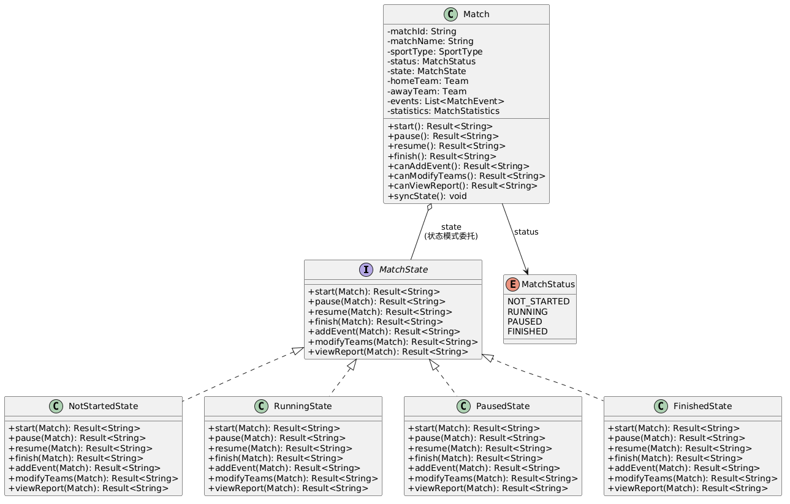

<p align="center"><b>图 3-1 状态模式类图</b></p>

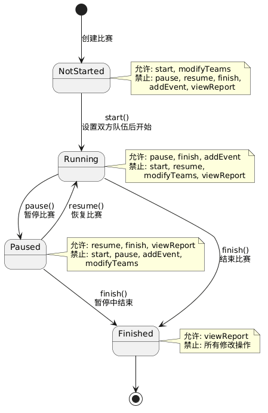

<p align="center"><b>图 3-2 比赛状态转换图</b></p>

**3. 适用场景**

状态模式适用于对象的行为随内部状态改变而改变的场景，尤其是状态转换逻辑复杂、存在多个状态且不同状态下操作权限不同的系统。典型场景包括订单状态管理、审批流程、比赛生命周期管理等。

**4. 项目适配性**

本项目中，比赛具有未开始、进行中、暂停中、已结束四种状态，不同状态下允许的操作严格不同（如未开始不能录入事件，已结束不能继续比赛）。若不使用状态模式，状态判断逻辑将以大量 if-else 散落在业务代码中，容易导致状态错乱。通过状态模式，每种状态的行为被封装到独立类中，状态切换时只需替换状态对象，新增状态时只需新增状态类，完全符合开闭原则。

### 3.3.2 责任链模式（Chain of Responsibility Pattern）

**1. 核心原理**

责任链模式是一种行为型设计模式，其核心思想是将多个处理对象连接成一条链，请求沿着链传递，直到某个处理器处理该请求或链末端。每个处理器只负责自己职责范围内的校验或处理逻辑，从而实现请求发送者与接收者的解耦。

**2. 结构角色**

- **Handler（抽象处理器）**：EventCheckHandler 抽象类，定义校验接口 handle() 和下一个处理器的引用 nextHandler。
- **ConcreteHandler（具体处理器）**：
  - BasicEventCheckHandler：校验事件基础数据是否完整（比赛ID、队伍ID、球员ID、事件类型不为空）。
  - StateCheckHandler：校验当前比赛状态是否允许录入事件。
  - PlayerCheckHandler：校验球员是否属于当前比赛的参赛队伍。
  - EventTypeCheckHandler：校验事件类型是否符合当前赛事类型。
  - ScoreCheckHandler：校验得分值是否合法（如篮球得分只能是 1、2、3 分）。
- **Chain（链）**：EventCheckChain 类，负责组装和编排校验链的执行顺序。

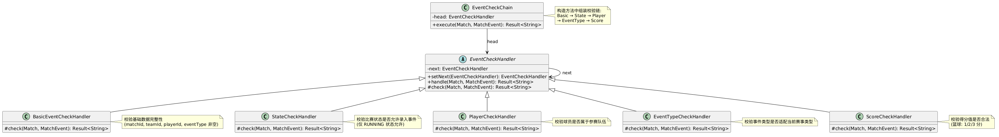

<p align="center"><b>图 3-3 责任链模式类图</b></p>

**3. 适用场景**

责任链模式适用于需要多层校验或处理的场景，尤其是校验规则多、规则可能动态变化、规则顺序可能调整的系统。典型场景包括参数校验、权限过滤、日志记录、请求拦截等。

**4. 项目适配性**

本项目中，比赛事件录入前需要经过基础数据校验、比赛状态校验、球员合法性校验、事件类型校验、得分合法性校验等多层校验。如果将所有校验逻辑写在一个方法中，代码冗长且难以维护。通过责任链模式，每类校验规则拆分为独立 Handler，后续新增赛事规则时只需新增处理器或调整链路顺序，不影响现有校验逻辑。

### 3.3.3 策略模式（Strategy Pattern）

**1. 核心原理**

策略模式是一种行为型设计模式，其核心思想是定义一系列算法，将每个算法封装到独立的策略类中，并使它们可以互相替换。策略模式使算法的变化独立于使用算法的客户端，客户端可以根据上下文动态选择所需的算法。

**2. 结构角色**

- **Strategy（抽象策略）**：AnalysisStrategy 接口，定义态势分析的统一方法 analyze(Match match)。
- **ConcreteStrategy（具体策略）**：
  - BasketballAnalysisStrategy：篮球赛事分析策略，分析得分、分差、篮板、助攻、犯规、失误等指标。
  - FootballAnalysisStrategy：足球赛事分析策略，分析进球、红黄牌、犯规、换人等指标。
  - VolleyballAnalysisStrategy：排球赛事分析策略，分析比分、发球得分、拦网、失误等指标。
  - GeneralAnalysisStrategy：通用赛事兜底策略，分析基本比分、分差和关键事件。
- **Context（上下文）**：SituationAnalysisAgent 根据 SportType 选择对应策略类执行分析。

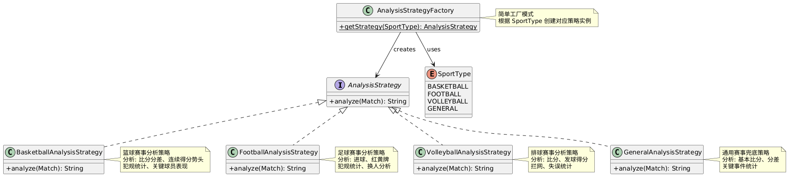

<p align="center"><b>图 3-4 策略模式类图</b></p>

**3. 适用场景**

策略模式适用于需要在运行时根据条件动态选择算法的场景，尤其是算法种类多、算法逻辑差异大、新增算法时不希望修改客户端代码的系统。典型场景包括支付策略、排序策略、分析策略等。

**4. 项目适配性**

本项目需要支持篮球、足球、排球等多类体育赛事的态势分析，不同赛事的分析指标和分析逻辑差异较大。如果将所有赛事的分析逻辑写在一个类中，会导致类膨胀且难以维护。通过策略模式，每种赛事的分析规则封装为独立策略类，系统根据 SportType 自动选择对应策略。新增赛事时只需新增策略类，完全符合开闭原则。

### 3.3.4 观察者模式（Observer Pattern）

**1. 核心原理**

观察者模式是一种行为型设计模式，其核心思想是定义对象间的一种一对多依赖关系，当一个对象的状态发生改变时，所有依赖于它的对象都会得到通知并自动更新。观察者模式实现了主题与观察者之间的松耦合，主题不需要知道具体观察者的实现细节。

**2. 结构角色**

- **Subject（主题）**：MatchEventPublisher 事件发布器，维护观察者列表，提供注册、注销和通知方法。
- **Observer（抽象观察者）**：MatchObserver 接口，定义 onEvent(Match, MatchEvent) 统一响应方法。
- **ConcreteObserver（具体观察者）**：
  - ScoreBoardObserver：比分板观察者，事件发生后更新比分展示。
  - StatisticsObserver：统计观察者，事件发生后更新多维度统计数据。
  - RiskWarningObserver：风险预警观察者，检测到连续得分、犯规过多等异常情况时生成风险提示。
  - ReportObserver：复盘观察者，记录事件素材为赛后复盘报告提供数据基础。

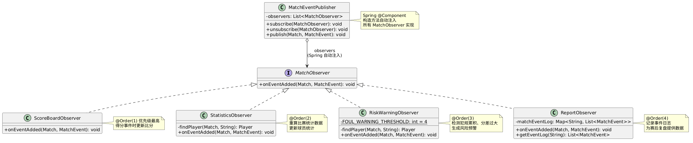

<p align="center"><b>图 3-5 观察者模式类图</b></p>

**3. 适用场景**

观察者模式适用于对象状态变化需要通知多个依赖对象的场景，尤其是依赖对象数量不固定、依赖关系可能动态变化的系统。典型场景包括事件驱动系统、消息通知、数据同步、UI 联动更新等。

**4. 项目适配性**

本项目中，每次录入比赛事件后，比分板、统计数据、风险预警、复盘素材等多个模块都需要同步更新。如果让 EventService 直接调用各个模块的更新方法，会导致 EventService 与各个模块高度耦合。通过观察者模式，EventService 只需通知事件发布器，由发布器统一分发给各个观察者，各观察者独立实现更新逻辑，模块之间互不依赖，新增监听模块时只需新增观察者类并注册即可。

# 四、系统需求分析

## 4\.1 功能性需求

根据项目业务场景，系统核心功能划分为以下 7 个模块：

### 4.1.1 用户认证模块

| 功能 | 输入 | 输出 | 业务作用 |
|---|---|---|---|
| 用户注册 | 用户名、密码、角色 | 注册结果 | 创建管理员或普通用户账户 |
| 用户登录 | 用户名、密码 | JWT Token | 生成认证令牌，确定用户角色 |
| 密码修改 | 旧密码、新密码 | 修改结果 | 用户自主修改账户密码 |
| 昵称修改 | 新昵称 | 修改结果 | 用户修改显示名称 |

### 4.1.2 比赛管理模块

| 功能 | 输入 | 输出 | 业务作用 |
|---|---|---|---|
| 创建比赛 | 比赛名称、赛事类型 | 比赛ID | 创建新比赛并初始化为未开始状态 |
| 设置参赛队伍 | 比赛ID、主队名称、客队名称 | 设置结果 | 为比赛分配参赛队伍 |
| 添加参赛球员 | 队伍ID、球员姓名、球衣号码 | 添加结果 | 为队伍添加球员名单 |
| 状态流转 | 比赛ID、目标操作 | 状态变更结果 | 开始/暂停/恢复/结束比赛，由状态模式驱动 |
| 查看比赛列表 | 筛选条件（可选） | 比赛列表 | 管理端和用户端展示比赛列表 |

### 4.1.3 事件采集与校验模块

| 功能 | 输入 | 输出 | 业务作用 |
|---|---|---|---|
| 录入比赛事件 | 比赛ID、队伍ID、球员ID、事件类型、得分值 | 录入结果 | 记录比赛过程中的各类事件 |
| 责任链校验 | 事件数据 | 校验通过/拒绝 | 依次经过基础校验、状态校验、球员校验、事件类型校验、得分校验 |
| 事件修改/删除 | 事件ID、修改内容 | 修改结果 | 管理端可修正已录入的事件 |

支持的事件类型包括：

- **篮球**：得分（SCORE）、犯规（FOUL）、助攻（ASSIST）、篮板（REBOUND）、抢断（STEAL）、失误（TURNOVER）、暂停（TIMEOUT）
- **足球**：进球（SCORE）、犯规（FOUL）、黄牌（YELLOW_CARD）、红牌（RED_CARD）、换人（SUBSTITUTION）
- **排球**：得分（SCORE）、拦网（BLOCK）、发球得分（SERVE_ACE）、失误（ERROR）、暂停（TIMEOUT）

### 4.1.4 数据统计模块

| 功能 | 输入 | 输出 | 业务作用 |
|---|---|---|---|
| 实时比分统计 | 比赛事件数据 | 双方比分 | 自动根据得分事件更新比分 |
| 球员统计 | 比赛事件数据 | 球员各维度统计 | 统计球员得分、犯规、助攻、篮板等 |
| 赛事统计 | 比赛事件数据 | 赛事维度统计 | 根据赛事类型统计特有指标（如足球红黄牌、排球拦网） |
| 排行榜 | 统计维度、赛事类型 | 排行榜数据 | 用户端展示球员得分榜、助攻榜等 |

### 4.1.5 态势分析模块

| 功能 | 输入 | 输出 | 业务作用 |
|---|---|---|---|
| 实时态势分析 | 当前比赛数据 | 分析文本 | 根据赛事类型选择对应策略生成态势分析 |
| AI 智能分析 | 结构化赛事数据 | AI 生成的分析文本 | 调用 DeepSeek 大模型生成深度态势分析 |
| 流式输出 | SSE 请求 | 实时文本流 | 通过 SSE 流式推送分析结果，实现打字机效果 |

### 4.1.6 赛后复盘模块

| 功能 | 输入 | 输出 | 业务作用 |
|---|---|---|---|
| 赛后复盘报告 | 完整比赛数据 | 复盘文本 | 比赛结束后生成胜负分析、关键球员表现、改进建议 |
| 报告存储与展示 | 报告内容 | 渲染后的报告 | 报告持久化存储并在详情页展示 |
| 报告版本覆盖 | 新报告 | 覆盖旧报告 | 同类型报告新版本自动覆盖旧版本 |

### 4.1.7 AI 赛事问答模块

| 功能 | 输入 | 输出 | 业务作用 |
|---|---|---|---|
| AI 赛事问答 | 用户提问文本 | AI 回答 | 基于赛事数据回答用户关于比赛的提问 |
| 对话持久化 | 对话记录 | 历史记录 | 保存用户与 AI 的对话历史 |
| AI 比赛推荐 | 用户偏好 | 推荐比赛列表 | AI 根据用户兴趣推荐正在进行的比赛 |

## 4\.2 非功能性需求

### 4.2.1 可扩展性

- 新增赛事类型时，只需新增对应的 AnalysisStrategy 策略类，无需修改核心业务代码。
- 新增事件校验规则时，只需新增 EventCheckHandler 处理器并注册到校验链中。
- 新增 AI 能力时，只需新增 AiAgent 接口的实现类，如后续可新增 PredictAgent 进行比赛预测。
- 新增观察者时，只需新增 MatchObserver 实现类并注册到事件发布器。

### 4.2.2 可维护性

- 系统采用五层分层架构，各层职责明确，模块之间低耦合。
- 设计模式的应用将复杂业务逻辑拆分为独立类，避免单一类膨胀。
- AI Agent 模块与业务模块完全解耦，Agent 可单独迭代升级而不影响业务层。
- 统一异常处理机制（GlobalExceptionHandler）确保异常信息规范化输出。

### 4.2.3 稳定性与可靠性

- 比赛状态管理采用状态模式，状态转换由状态类内部控制，避免非法状态跳转。
- 事件录入必须经过完整责任链校验，非法数据无法进入系统。
- AI 服务不可用时自动降级为本地规则 Agent（LocalRuleAgent），确保核心功能不受影响。
- 报告生成采用同类型覆盖机制，保证数据一致性。

### 4.2.4 安全性

- 采用 JWT 多角色认证，管理端和用户端接口分别鉴权，防止越权访问。
- 管理端接口仅允许 ADMIN 角色访问，用户端接口允许 USER 角色访问。
- 敏感操作（如删除比赛、修改事件）仅管理端可执行。

### 4.2.5 易用性

- 管理端提供比赛管理看板，支持比赛创建、队伍设置、球员添加、状态控制等一站式操作。
- 用户端提供比赛详情页、排行榜、AI 问答等只读功能，界面简洁直观。
- AI 报告采用 SSE 流式输出，实时展示生成过程，提升用户体验。
- 事件录入采用下拉选择交互，减少用户输入错误。

## 4\.3 业务流程分析

### 4.3.1 比赛创建与初始化流程

管理员在管理端创建比赛，选择赛事类型（篮球/足球/排球/通用），系统创建比赛并初始化为"未开始"状态。随后管理员设置主队和客队，并为两支队伍添加参赛球员。比赛准备就绪后，管理员点击开始比赛，状态从"未开始"转为"进行中"。

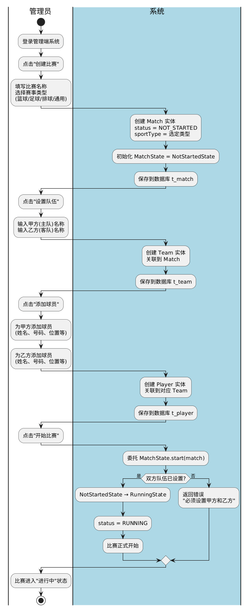

<p align="center"><b>图 4-1 比赛创建与初始化流程图</b></p>

### 4.3.2 事件录入与联动更新流程

比赛进行中，管理员在管理端录入比赛事件（如得分、犯规、助攻等）。事件数据进入系统后，首先经过责任链校验：基础数据校验 → 比赛状态校验 → 球员合法性校验 → 事件类型校验 → 得分合法性校验。若校验失败，返回具体错误信息；若校验通过，事件保存到数据库，并触发观察者联动更新：比分板观察者更新比分、统计观察者更新统计数据、风险预警观察者检测异常情况、复盘观察者记录事件素材。

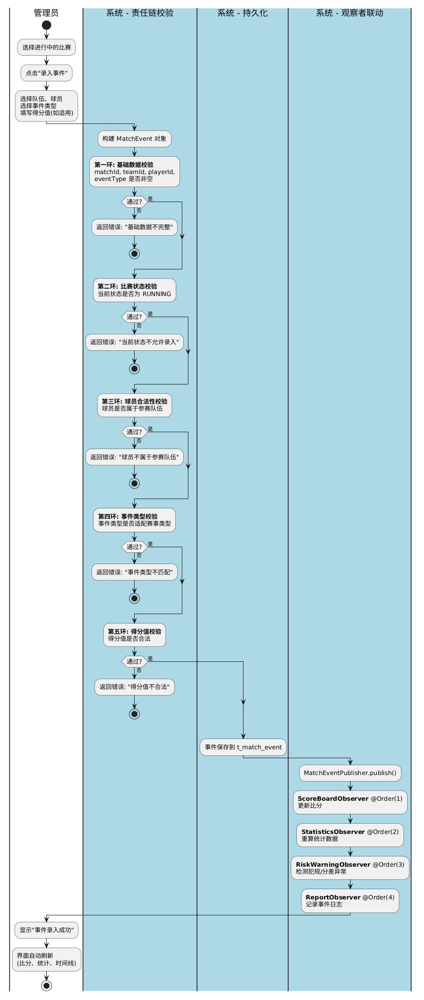

<p align="center"><b>图 4-2 事件录入与联动更新流程图</b></p>

### 4.3.3 态势分析流程

比赛进行中，管理员或用户可以触发态势分析。系统根据比赛的 SportType 自动选择对应的分析策略（BasketballAnalysisStrategy / FootballAnalysisStrategy / VolleyballAnalysisStrategy / GeneralAnalysisStrategy），生成基础分析结果。随后调用 SituationAnalysisAgent，将结构化赛事数据传递给 AI 模型（或本地规则 Agent），生成深度态势分析文本。分析结果通过 SSE 流式推送给前端实时展示。

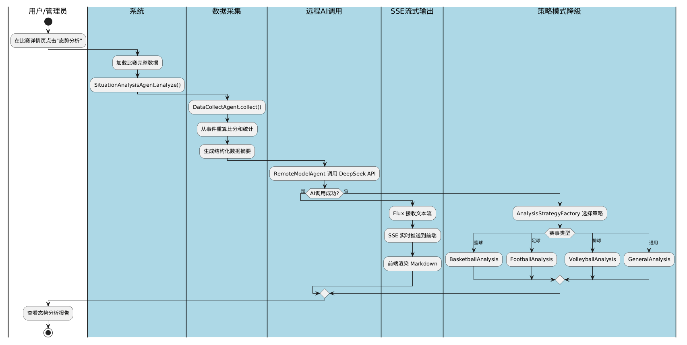

<p align="center"><b>图 4-3 态势分析流程图</b></p>

### 4.3.4 赛后复盘流程

管理员点击结束比赛，比赛状态转为"已结束"。系统汇总比赛全量数据（最终比分、事件时间线、球员统计、关键事件等），调用 ReviewReportAgent 生成赛后复盘报告。复盘内容包括胜负分析、关键球员表现、关键事件回顾、改进建议等。报告生成后持久化存储，并在管理端和用户端比赛详情页自动加载展示。

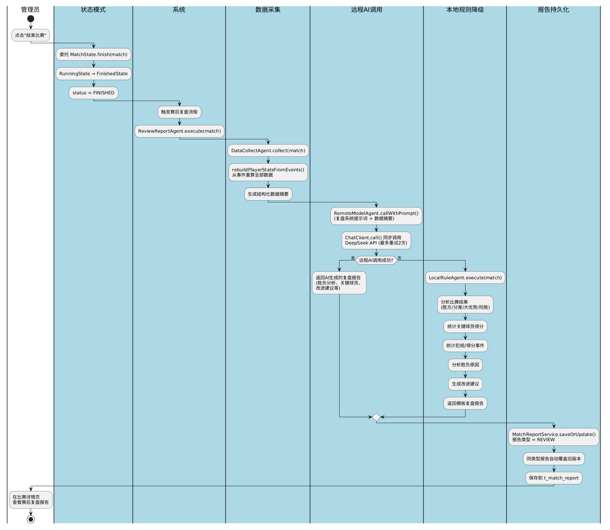

<p align="center"><b>图 4-4 赛后复盘流程图</b></p>

# 五、系统总体设计

## 5\.1 系统架构设计

本项目采用五层分层架构，自上而下依次为表现层、业务服务层、设计模式核心层、AI Agent 封装层和数据层。各层职责明确、单向依赖，上层通过接口调用下层，不允许跨层或反向依赖。

```text
表现层（Controller + 静态页面）
  ↓
业务服务层（Service）
  ↓
设计模式核心层（state / chain / strategy / observer）
  ↓
AI Agent 封装层（agent）
  ↓
数据层（Mapper + MySQL）
```

**表现层**：由 Spring Boot Controller 和原生 HTML/CSS/JavaScript 页面组成，负责接收 HTTP 请求和返回响应。管理端包括 MatchController、EventController、PlayerController、TeamController 等；用户端包括 ClientMatchController、ClientTeamController 等；认证由 AuthController 负责。

**业务服务层**：包括 MatchService、EventService、StatisticsService、ReportService、DashboardService、PlayerService 等，负责编排业务流程，调用下层的设计模式模块和 AI Agent 模块。

**设计模式核心层**：包括状态模式（state）、责任链模式（chain）、策略模式（strategy）、观察者模式（observer）四个子包，负责约束系统的核心业务行为。

**AI Agent 封装层**：包括 AiAgent 统一接口、DataCollectAgent、SituationAnalysisAgent、ReviewReportAgent、LocalRuleAgent、RemoteModelAgent 等，负责赛事数据采集、态势分析、赛后复盘等智能分析能力。

**数据层**：由 MyBatis-Plus Mapper 和 MySQL 数据库组成，包括 MatchMapper、TeamMapper、PlayerMapper、MatchEventMapper、PlayerStatisticsMapper 等，负责数据的持久化存储和查询。

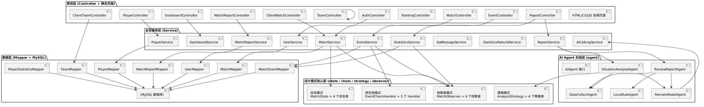

<p align="center"><b>图 5-1 系统架构图</b></p>

## 5\.2 系统模块划分

系统按业务功能和职责边界划分为以下核心模块：

| 模块 | 对应包/类 | 职责 | 调用关系 |
|---|---|---|---|
| 用户认证模块 | AuthController, JwtInterceptor, UserService | 登录/注册/JWT验证 | 被表现层调用，提供认证拦截 |
| 比赛管理模块 | MatchController, MatchService, MatchMapper | 比赛CRUD、状态流转 | 调用状态模式、观察者模式 |
| 事件采集模块 | EventController, EventService, MatchEventMapper | 事件录入、校验、修改 | 调用责任链校验、观察者通知 |
| 数据统计模块 | ReportController, StatisticsService | 比分、球员、赛事统计 | 调用数据层查询，被观察者更新 |
| 态势分析模块 | SituationAnalysisAgent, AnalysisStrategy | 实时态势分析 | 调用策略模式、远程AI或本地降级 |
| 赛后复盘模块 | ReviewReportAgent, LocalRuleAgent | 赛后复盘报告生成 | 调用数据采集Agent、远程AI或本地降级 |
| AI问答模块 | QaMessageService, RemoteModelAgent | AI赛事问答、对话持久化 | 调用远程AI模型 |
| 数据看板模块 | DashboardController, DashboardService | 管理端概览数据 | 调用比赛、统计等服务 |
| 排行榜模块 | RankingController | 球员得分榜、助攻榜 | 调用数据层查询 |

模块拆分遵循单一职责原则：每个模块只负责一类业务功能，通过 Spring 依赖注入实现模块间协作。

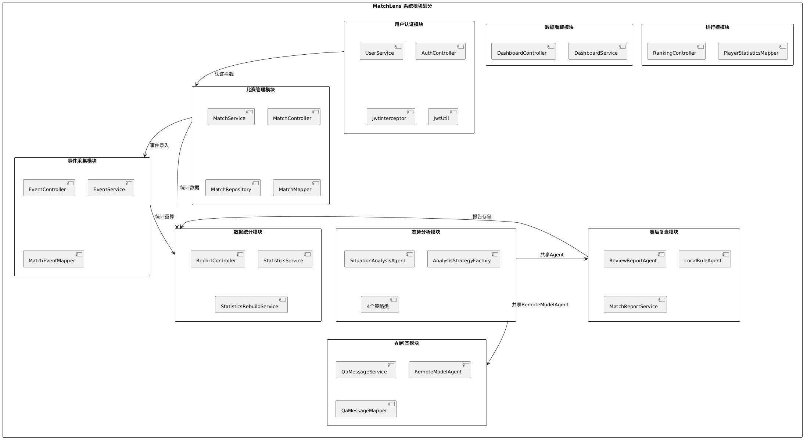

<p align="center"><b>图 5-2 系统模块划分图</b></p>

## 5\.3 核心类图设计

### 5.3.1 实体类设计

系统核心实体类包括：

- **Match**：比赛实体，包含 matchId、matchName、sportType、status、homeTeam、awayTeam、events、statistics 等字段，通过状态模式委托 MatchState 处理状态操作。
- **Team**：队伍实体，包含 teamId、teamName、score、players 等字段。
- **Player**：球员实体，包含 playerId、playerName、teamId、number、statistics（Map）等字段。
- **MatchEvent**：比赛事件实体，包含 eventId、matchId、teamId、playerId、eventType、scoreValue、eventTime、description 等字段。
- **MatchStatistics**：比赛统计类（运行时计算，不建表），包含 homeScore、awayScore、eventCount、leadingTeam、scoreDifference 等字段。
- **User**：用户实体，包含 userId、username、password、nickname、role 等字段。

### 5.3.2 设计模式类结构

- **状态模式**：MatchState 接口 + NotStartedState、RunningState、PausedState、FinishedState 四个实现类，Match 组合引用 MatchState。
- **责任链模式**：EventCheckHandler 抽象类 + 五个具体 Handler，EventCheckChain 负责组装。
- **策略模式**：AnalysisStrategy 接口 + 四个具体策略类，AnalysisStrategyFactory 根据 SportType 创建策略。
- **观察者模式**：MatchObserver 接口 + 四个具体观察者，MatchEventPublisher 维护观察者列表并分发通知。

### 5.3.3 AI Agent 类结构

- **AiAgent**：统一接口，定义 execute(Match) 方法。
- **DataCollectAgent**：数据采集 Agent，从 Match 中采集结构化数据。
- **RemoteModelAgent**：远程模型 Agent，通过 Spring AI ChatClient 调用 DeepSeek API。
- **LocalRuleAgent**：本地规则 Agent，作为降级方案使用模板生成报告。
- **SituationAnalysisAgent**：态势分析 Agent，编排远程AI和策略模式降级。
- **ReviewReportAgent**：复盘报告 Agent，编排远程AI和 LocalRuleAgent 降级。

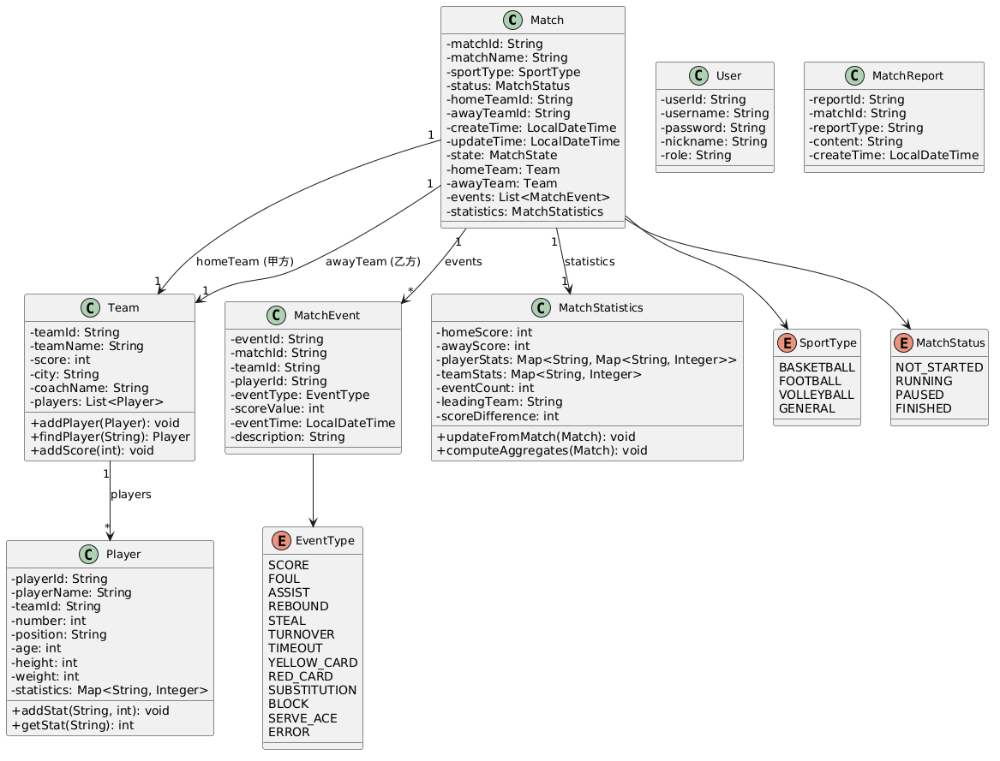

<p align="center"><b>图 5-3 核心实体类图</b></p>

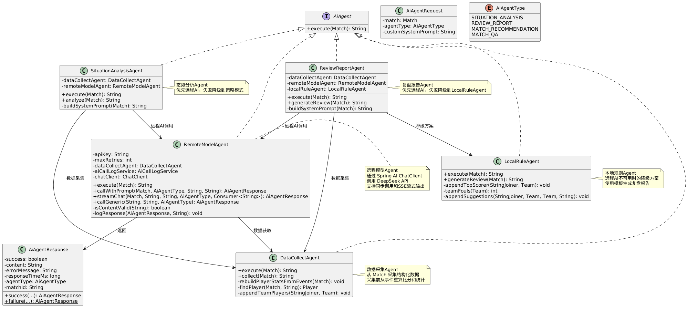

<p align="center"><b>图 5-4 AI Agent 类结构图</b></p>

## 5\.4 核心业务时序图

### 5.4.1 事件录入时序

管理员在管理端提交事件录入请求，EventController 接收请求并调用 EventService。EventService 将事件数据传递给 EventCheckChain 进行责任链校验，校验通过后保存事件到数据库，然后通过 MatchEventPublisher 发布事件通知。MatchEventPublisher 遍历所有已注册的 MatchObserver，依次触发 ScoreBoardObserver、StatisticsObserver、RiskWarningObserver、ReportObserver 的响应逻辑。

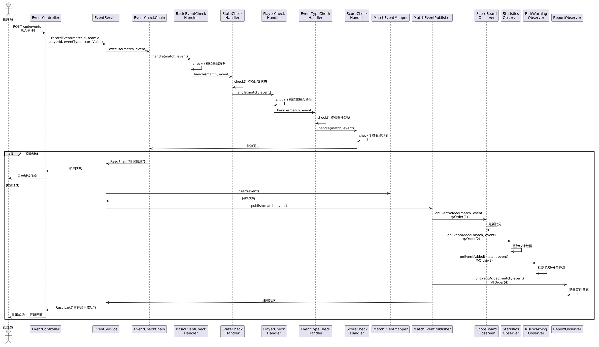

<p align="center"><b>图 5-5 事件录入时序图</b></p>

### 5.4.2 态势分析时序

前端发起态势分析请求，Controller 调用 SituationAnalysisAgent。Agent 首先通过 DataCollectAgent 采集比赛结构化数据，然后通过 RemoteModelAgent 调用 DeepSeek API 生成分析结果。若远程调用成功，直接返回 AI 分析文本；若失败，降级到 AnalysisStrategyFactory 根据 SportType 选择对应策略类生成本地分析结果。

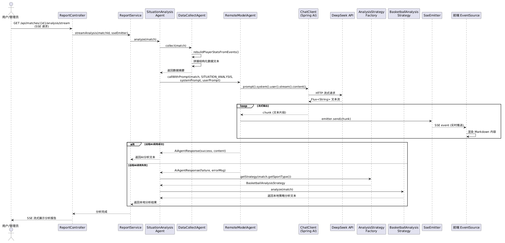

<p align="center"><b>图 5-6 态势分析时序图</b></p>

### 5.4.3 赛后复盘时序

管理员结束比赛后触发复盘请求，Controller 调用 ReviewReportAgent。Agent 通过 DataCollectAgent 采集数据，然后通过 RemoteModelAgent 调用远程 AI 生成复盘报告。若远程调用失败，降级到 LocalRuleAgent 使用本地规则模板生成报告。报告生成后由 MatchReportService 持久化存储。

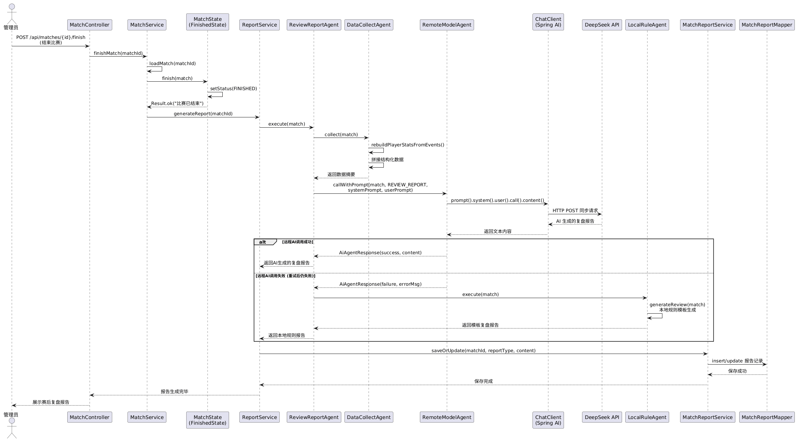

<p align="center"><b>图 5-7 赛后复盘时序图</b></p>

## 5\.5 设计模式整体应用方案

本项目中 4 种设计模式协同工作，从不同维度约束系统架构：

1. **状态模式约束比赛生命周期**：所有状态操作必须通过 MatchState 接口委托，禁止在业务代码中直接修改状态值，确保状态转换的合法性和可控性。
2. **责任链模式约束事件数据质量**：所有事件录入必须经过完整校验链，每类校验规则独立封装，避免校验逻辑混杂在业务方法中。
3. **策略模式约束多赛事分析扩展**：不同赛事的分析规则通过独立策略类实现，新增赛事时只需新增策略类，不影响核心业务代码。
4. **观察者模式约束事件联动机制**：事件发生后的比分更新、统计计算、风险预警、复盘记录等操作由观察者独立处理，避免 EventService 直接依赖多个模块。

这 4 种设计模式与 AI Agent 模块协同工作，形成完整的架构约束体系：状态模式保证比赛状态不错乱，责任链保证事件数据不混乱，策略模式保证多赛事分析可扩展，观察者保证事件联动低耦合，AI Agent 保证智能分析能力可替换。该设计有效约束了 Vibe Coding 增量开发过程中的代码结构，避免了 AI 生成代码的随意堆砌和架构退化。

# 六、系统实现

## 6\.1 整体实现思路

本系统采用"先架构设计、后增量迭代"的开发思路，遵循 Vibe Coding 规范化流程，分阶段完成系统实现。

**开发顺序**：首先搭建项目骨架（实体类、枚举、接口、设计模式骨架），然后按"状态模式 → 责任链模式 → 观察者模式 → 策略模式 → AI Agent 模块"的顺序逐步实现业务功能，每完成一个模块即进行功能验证和代码重构。

**代码规范**：实体类使用 MyBatis-Plus 注解进行 ORM 映射，Service 层通过构造方法注入依赖，Controller 层统一返回 Result 对象，AI Agent 模块实现 AiAgent 统一接口并通过 Spring 组件注册。

**设计模式落地策略**：状态模式通过 MatchState 接口约束状态操作；责任链模式通过 EventCheckChain 组装校验链；策略模式通过 AnalysisStrategyFactory 根据 SportType 创建策略；观察者模式通过 MatchEventPublisher 和 Spring 自动注入实现观察者注册。

**架构落地方式**：各层通过 Spring 依赖注入实现解耦，上层依赖下层接口而非具体实现。AI Agent 模块与业务模块通过 AiAgent 接口解耦，支持本地规则和远程模型的无缝切换。

## 6\.2 核心模块实现

### 6.2.1 比赛状态管理模块实现

本模块基于状态模式实现比赛全生命周期管理。MatchState 接口定义了 start()、pause()、resume()、finish()、addEvent()、modifyTeams()、viewReport() 七个方法，四个具体状态类分别实现不同状态下的行为。

**NotStartedState**：允许开始比赛（start）、修改队伍（modifyTeams），禁止录入事件（addEvent）、暂停、结束等操作。

**RunningState**：允许录入事件（addEvent）、暂停（pause）、结束（finish），禁止修改队伍信息。

**PausedState**：允许恢复比赛（resume）、结束（finish）、查看报告（viewReport），禁止录入事件。

**FinishedState**：允许查看报告（viewReport），禁止所有修改操作。

MatchService 在处理状态操作时，将操作委托给当前状态对象：

```java
// 状态模式驱动的状态流转
MatchState currentState = match.getCurrentState();
Result<String> result = currentState.start(match);  // 委托给状态对象
```

该设计避免了在 MatchService 中出现大量 if-else 状态判断，状态切换时只需替换状态对象，新增状态时只需新增状态类。

### 6.2.2 事件录入与校验模块实现

本模块结合责任链模式和观察者模式实现事件录入全流程。

**责任链校验实现**：EventCheckChain 在构造方法中组装校验链，依次为基础校验、状态校验、球员校验、事件类型校验、得分校验五个 Handler。每个 Handler 继承 EventCheckHandler 抽象类，实现 handle() 方法并持有下一个 Handler 的引用：

```java
// EventCheckChain 构造方法中组装校验链
EventCheckHandler basic = new BasicEventCheckHandler();
EventCheckHandler state = new StateCheckHandler();
EventCheckHandler player = new PlayerCheckHandler();
EventCheckHandler eventType = new EventTypeCheckHandler();
EventCheckHandler score = new ScoreCheckHandler();
basic.setNext(state).setNext(player).setNext(eventType).setNext(score);
```

**观察者联动实现**：校验通过并保存事件后，EventService 调用 MatchEventPublisher.publish() 通知所有观察者。MatchEventPublisher 通过 Spring 自动注入所有 MatchObserver 实现类，遍历调用 onEventAdded() 方法：

```java
// 事件录入成功后发布通知
eventCheckChain.execute(match, event);  // 责任链校验
matchEventMapper.insert(event);          // 保存事件
matchEventPublisher.publish(match, event); // 观察者通知
```

ScoreBoardObserver 更新比分展示，StatisticsObserver 更新多维度统计，RiskWarningObserver 检测连续得分等异常，ReportObserver 记录复盘素材。

## 6\.3 AI Agent 模块解耦实现

AI Agent 模块是系统的智能分析核心，采用统一接口 + 多实现类的解耦设计，通过 AiAgent 接口定义统一的 execute(Match) 方法，所有 Agent 实现类均实现该接口。

**Agent 分层架构**：

- **数据采集层**：DataCollectAgent 负责从 Match 实体中采集结构化数据，包括比赛基本信息、双方球员数据、事件时间线和汇总统计。采集前会从事件列表重算球员统计和比分，确保数据与事件时间线严格一致（避免 Team.score 种子值与实时比分不一致的问题）。
- **远程调用层**：RemoteModelAgent 通过 Spring AI ChatClient 调用 DeepSeek API，支持同步调用（callWithPrompt 方法，带重试机制）和流式调用（streamChat 方法，返回 Flux）。每次调用记录日志到 AiCallLogService。
- **降级机制**：ReviewReportAgent 和 SituationAnalysisAgent 优先调用远程 AI，失败时自动降级。ReviewReportAgent 降级到 LocalRuleAgent（本地规则模板生成复盘报告），SituationAnalysisAgent 降级到 AnalysisStrategyFactory 根据 SportType 选择对应策略类。

**Agent 解耦设计**：Agent 模块不直接操作数据库，不直接修改比赛状态，只接收整理后的比赛数据并返回分析文本。业务层通过 AiAgent 接口调用 Agent，不依赖具体实现类。当需要替换 AI 能力时（如从 DeepSeek 切换到其他模型），只需新增 RemoteModelAgent 的实现类，不影响业务代码。

**SSE 流式输出实现**：态势分析报告采用 SSE 流式输出，RemoteModelAgent.streamChat() 方法通过 ChatClient 流式调用获取 Flux 文本流，每收到一个文本片段就通过回调函数推送到 SseEmitter，前端通过 EventSource 实时接收并渲染为 Markdown 内容。

## 6\.4 代码迭代与架构优化实现

本项目经过多轮迭代重构，主要优化内容包括：

**1. 策略选择逻辑提取**：

- **重构前**：策略选择逻辑直接写在 SituationAnalysisAgent 中，通过 switch-case 判断 SportType 创建策略类。
- **重构后**：提取 AnalysisStrategyFactory 简单工厂类，集中管理策略创建逻辑，使 Agent 代码更简洁，策略扩展更方便。

**2. 比分数据源统一**：

- **重构前**：部分模块直接读取 Team.score 字段作为比分，但 Team.score 是数据库初始化种子值，并非实时动态比分。
- **重构后**：DataCollectAgent 在采集数据前通过 rebuildPlayerStatsFromEvents() 从事件列表重算球员统计和比分，所有依赖比分的模块统一从 MatchStatistics 读取。

**3. MyBatis-Plus 实体状态同步**：

- **重构前**：Match 实体中的 transient state 字段依赖 setter 方法初始化，但 MyBatis-Plus 通过反射直接设置字段值，不触发 setter。
- **重构后**：在 MatchService 加载比赛后手动调用状态初始化方法，确保 transient 字段正确赋值。

**4. 路由冲突修复**：

- **重构前**：MatchController 和 ReportController 中定义了相同的 GET /api/matches/{id}/statistics 路径，导致 Spring 启动时报 Ambiguous handler 错误。
- **重构后**：将统计接口统一由 ReportController 提供，MatchController 不再重复定义。

**5. 观察者自动注册**：

- **重构前**：观察者需要手动实例化和注册到 MatchEventPublisher。
- **重构后**：所有观察者通过 @Component 注册为 Spring Bean，MatchEventPublisher 构造方法通过 Spring 自动注入 List\<MatchObserver\> 实现自动注册，简化观察者管理。

# 七、系统测试

## 7\.1 测试环境

本次系统测试在以下环境中进行：

| 类别 | 配置信息 |
|---|---|
| 操作系统 | Windows 11 25H2 |
| 处理器 | Intel Core i5 / AMD Ryzen 5 及以上 |
| 内存 | 16GB |
| Java 版本 | JDK 21 |
| 数据库 | MySQL 8.0（本地部署） |
| 后端框架 | Spring Boot 4.0.7 |
| AI 模型 | DeepSeek API（通过 Spring AI 接入） |
| 浏览器 | Chrome 最新版 |
| 网络环境 | 校园网 / 家庭宽带（AI API 调用需要外网访问） |

测试环境与正式运行环境一致，保障测试结果真实有效。

## 7\.2 测试目的与原则

### 7\.2\.1 测试目的

验证系统所有核心功能是否满足需求分析要求，检测系统运行稳定性、兼容性与可靠性，排查代码缺陷、逻辑漏洞、模块耦合问题，验证架构优化与设计模式落地效果，确保项目可正常稳定运行。

### 7\.2\.2 测试原则

遵循全覆盖性、针对性、真实性、独立性原则，覆盖所有核心业务模块与边界场景，测试过程真实可复现，测试结果客观公正。

## 7\.3 测试用例设计

针对系统核心功能设计以下测试用例：

### 7.3.1 比赛管理模块测试用例

| 编号 | 测试场景 | 输入/操作 | 预期结果 |
|---|---|---|---|
| TC-01 | 创建篮球比赛 | 名称"测试篮球赛"，类型BASKETBALL | 创建成功，状态为未开始 |
| TC-02 | 设置参赛队伍 | 主队"A队"，客队"B队" | 设置成功，队伍关联到比赛 |
| TC-03 | 添加球员 | 球员"张三"号码7，属于A队 | 添加成功，球员关联到队伍 |
| TC-04 | 开始比赛 | 点击开始 | 状态变为进行中 |
| TC-05 | 未开始状态录入事件 | 尝试录入得分事件 | 校验失败，拒绝录入 |

### 7.3.2 事件录入与校验测试用例

| 编号 | 测试场景 | 输入/操作 | 预期结果 |
|---|---|---|---|
| TC-06 | 正常录入得分事件 | 类型SCORE，得分值2，合法球员 | 录入成功，比分自动更新 |
| TC-07 | 非法球员事件 | 球员不属于参赛队伍 | 责任链拦截，返回错误信息 |
| TC-08 | 非法得分值 | 篮球得分值4 | 责任链拦截，返回错误信息 |
| TC-09 | 结束后录入事件 | 比赛已结束，尝试录入事件 | 状态校验拦截，拒绝录入 |
| TC-10 | 事件联动更新 | 录入得分事件 | 比分、统计、复盘素材同步更新 |

### 7.3.3 AI Agent 模块测试用例

| 编号 | 测试场景 | 输入/操作 | 预期结果 |
|---|---|---|---|
| TC-11 | 态势分析（AI可用） | 触发态势分析 | 返回AI生成的分析文本 |
| TC-12 | 态势分析（AI不可用） | 模拟API Key未配置 | 降级到本地策略分析 |
| TC-13 | 赛后复盘（AI可用） | 触发赛后复盘 | 返回AI生成的复盘报告 |
| TC-14 | 赛后复盘（AI不可用） | 模拟API调用失败 | 降级到LocalRuleAgent模板报告 |
| TC-15 | AI赛事问答 | 输入"这场比赛谁领先？" | 返回基于赛事数据的回答 |

### 7.3.4 多赛事策略测试用例

| 编号 | 测试场景 | 输入/操作 | 预期结果 |
|---|---|---|---|
| TC-16 | 篮球策略分析 | 篮球比赛触发态势分析 | 调用BasketballAnalysisStrategy |
| TC-17 | 足球策略分析 | 足球比赛触发态势分析 | 调用FootballAnalysisStrategy |
| TC-18 | 通用策略降级 | 通用赛事触发态势分析 | 调用GeneralAnalysisStrategy |

## 7\.4 功能测试结果与运行展示

### 7.4.1 登录注册功能测试

系统提供统一的登录注册页面，支持管理员（ADMIN）和普通用户（USER）两种角色登录。登录成功后根据角色自动跳转至管理端首页或用户端首页，JWT Token 存储在客户端用于后续接口认证。注册页面支持用户自主选择角色，密码采用明文存储以简化课程设计实现。

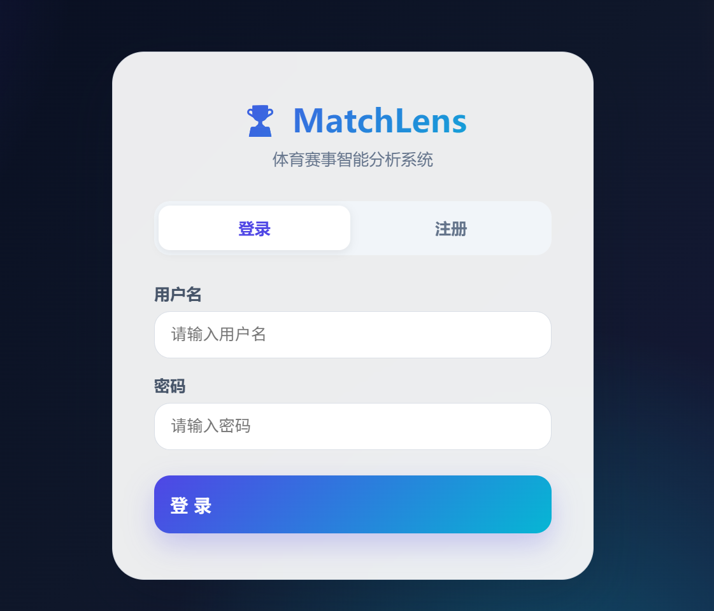

<p align="center"><b>图 7-1 登录注册页面：支持管理员和普通用户两种角色登录，JWT Token 认证</b></p>

### 7.4.2 管理端首页测试

管理员登录后进入管理端首页，页面展示系统数据看板，包括比赛总数、进行中比赛、已结束比赛、球员总数等概览统计数据，为管理员提供全局赛事数据一览。

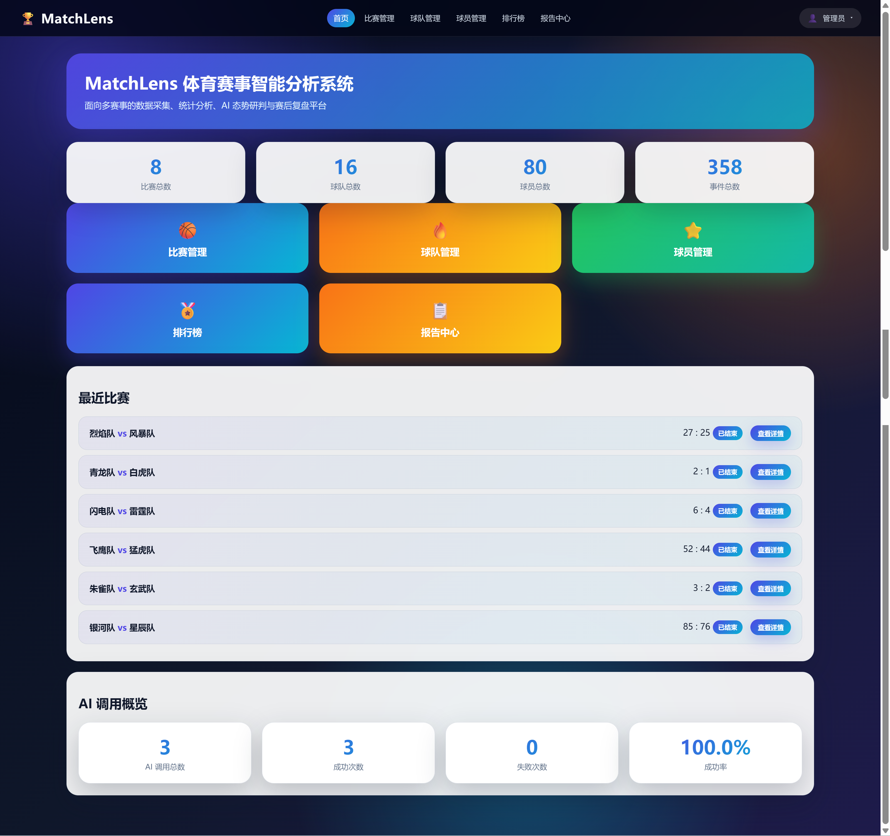

<p align="center"><b>图 7-2 管理端首页：展示比赛总数、进行中比赛、已结束比赛、球员总数等概览数据</b></p>

### 7.4.3 管理端比赛管理功能测试

管理端比赛管理页面支持比赛创建、队伍设置、球员添加、状态控制（开始/暂停/恢复/结束）等全生命周期操作。比赛列表展示所有比赛及其当前状态，管理员可对每场比赛进行详情管理和事件录入。状态流转由状态模式驱动，不同状态下可执行的操作严格受控。

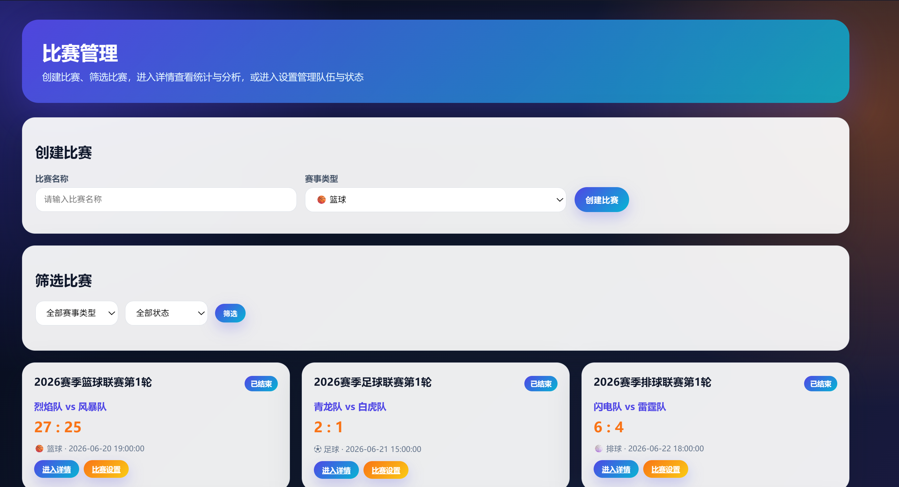

<p align="center"><b>图 7-3 管理端比赛管理：支持比赛创建、队伍设置、球员添加、状态控制等全生命周期操作</b></p>

### 7.4.4 管理端球队管理功能测试

管理端球队管理页面支持查看所有参赛球队信息，包括球队名称、所属比赛、球员名单等。管理员可对球队信息进行管理，确保参赛队伍数据完整。

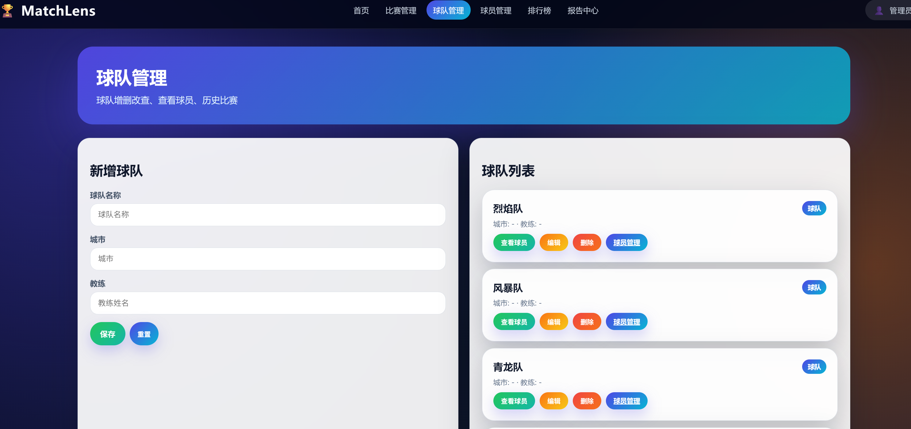

<p align="center"><b>图 7-4 管理端球队管理：查看参赛球队信息、球员名单，确保参赛队伍数据完整</b></p>

### 7.4.5 管理端球员管理功能测试

管理端球员管理页面展示所有已注册球员信息，包括球员姓名、球衣号码、所属球队、位置、年龄、身高、体重等详细数据，支持按球队筛选查看。

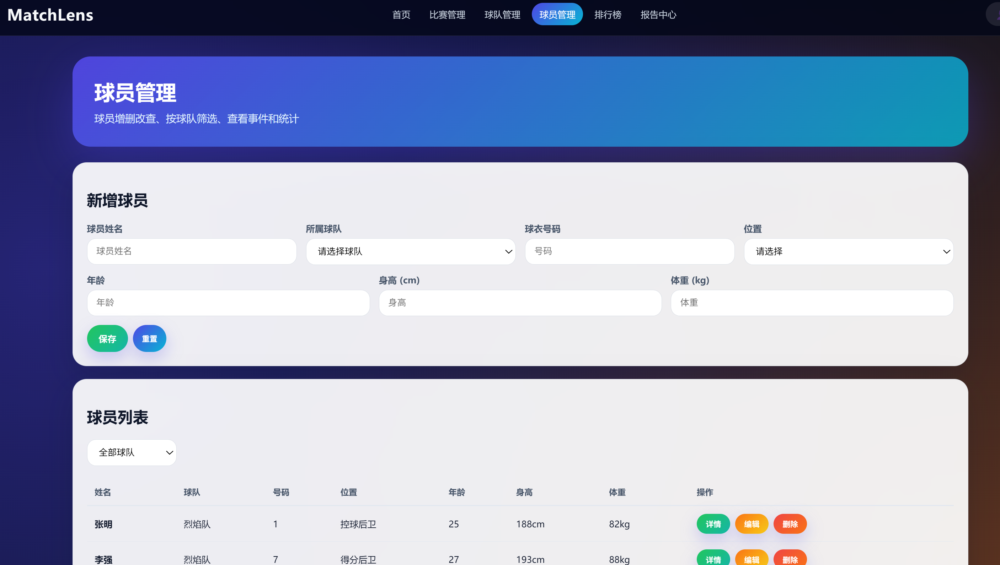

<p align="center"><b>图 7-5 管理端球员管理：展示球员姓名、球衣号码、所属球队、位置、年龄等详细数据</b></p>

### 7.4.6 管理端报告中心功能测试

管理端报告中心页面集中展示所有已生成的 AI 报告，包括态势分析报告和赛后复盘报告。管理员可查看各场比赛的历史报告，报告内容以 Markdown 格式渲染展示，同类型报告新版本自动覆盖旧版本。

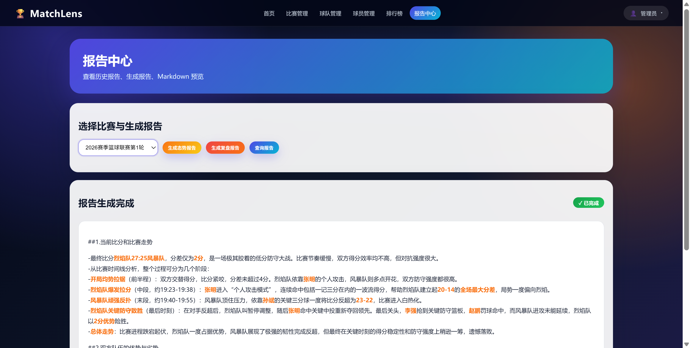

<p align="center"><b>图 7-6 管理端报告中心：集中展示态势分析报告和赛后复盘报告，支持 Markdown 渲染</b></p>

### 7.4.7 管理端历史报告查看测试

管理端支持查看已生成报告的历史版本，管理员可在报告中心点击具体报告查看详细内容。报告内容由 AI Agent 生成并持久化存储，展示包括胜负分析、关键球员表现、改进建议等复盘信息。

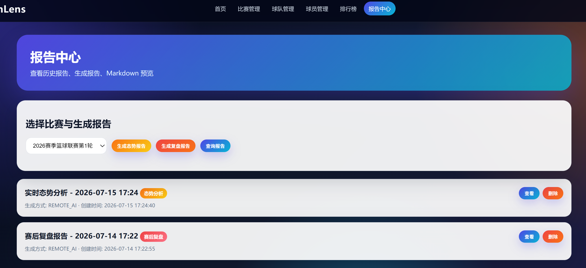

<p align="center"><b>图 7-7 管理端历史报告：查看 AI Agent 生成的胜负分析、关键球员表现、改进建议等复盘内容</b></p>

### 7.4.8 用户端比赛详情页功能测试

用户端比赛详情页提供只读的比赛信息展示，包括双方比分、事件时间线、实时统计数据、AI 态势分析报告和赛后复盘报告。事件时间线按时间顺序展示所有比赛事件，统计面板展示得分、犯规、助攻、篮板等多维度数据。页面自动加载并展示最新生成的 AI 报告。

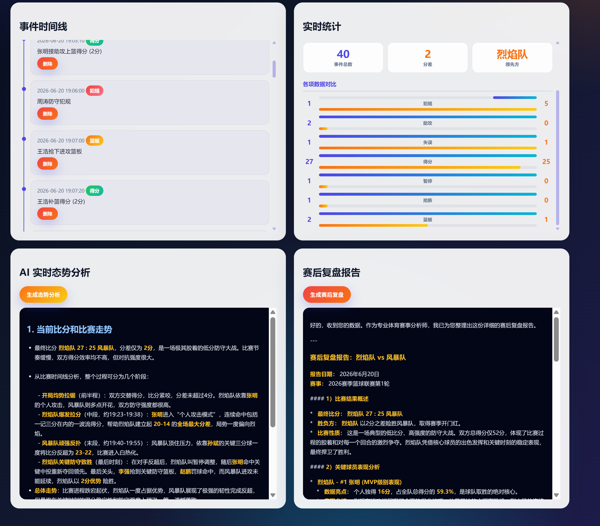

<p align="center"><b>图 7-8 用户端比赛详情页：展示双方比分、事件时间线、实时统计、AI 态势分析与赛后复盘报告</b></p>

### 7.4.9 用户端 AI 赛事问答功能测试

用户端提供 AI 赛事问答助手功能，用户可以针对比赛内容进行提问，AI 基于赛事数据实时生成回答。对话历史持久化存储，支持多轮对话交互。问答范围限定于赛事相关数据，包括比分、球员表现、赛事规则等。

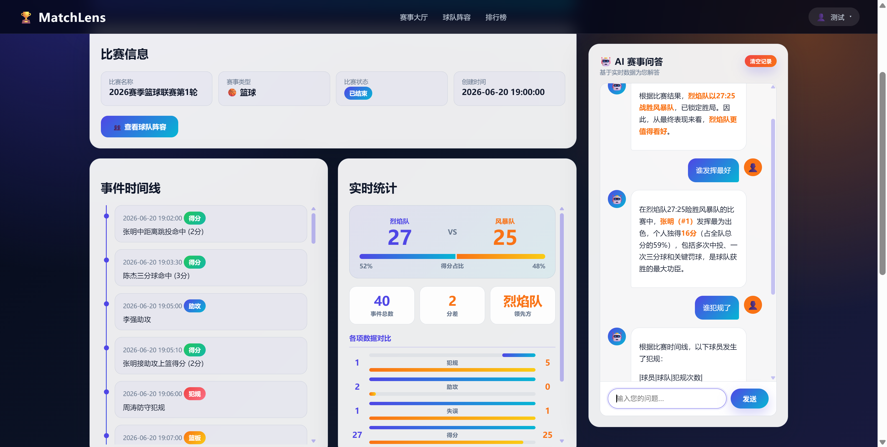

<p align="center"><b>图 7-9 用户端 AI 赛事问答：基于赛事数据实时回答用户提问，支持多轮对话与历史持久化</b></p>

### 7.4.10 用户端 AI 比赛推荐功能测试

用户端提供 AI 比赛推荐功能，AI 根据用户兴趣和当前赛事数据，智能推荐正在进行的比赛。用户可通过推荐功能快速发现感兴趣的赛事，提升观赛体验。

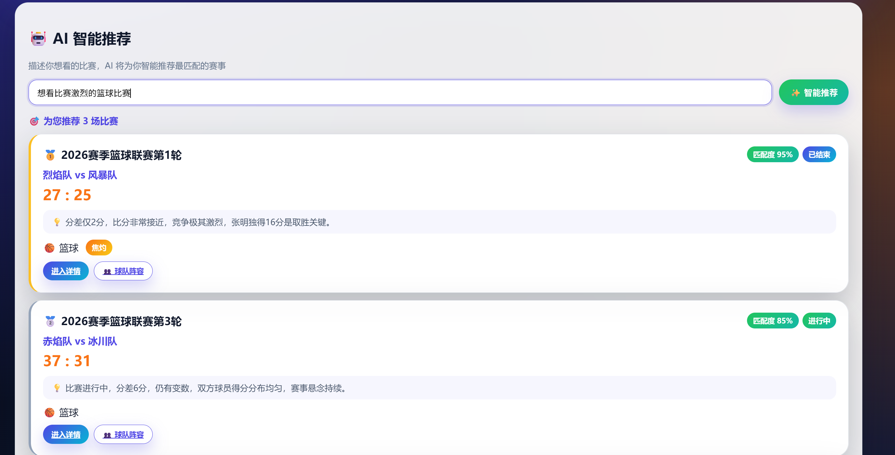

<p align="center"><b>图 7-10 用户端 AI 比赛推荐：AI 根据用户兴趣智能推荐正在进行的赛事</b></p>

## 7\.5 测试问题修复与优化

测试过程中发现并修复的主要问题如下：

| 序号 | 问题现象 | 问题成因 | 修复方案 |
|---|---|---|---|
| 1 | 启动时报 Ambiguous handler 错误 | MatchController 和 ReportController 定义了相同的 /api/matches/{id}/statistics 路径 | 将统计接口统一由 ReportController 提供，移除 MatchController 中的重复定义 |
| 2 | 从数据库加载比赛后状态操作报错 | MyBatis-Plus 通过反射设值不触发 setter，transient state 字段未初始化 | 在 MatchService 加载比赛后手动调用状态初始化方法 |
| 3 | DataCollectAgent 报告的比分与实际事件不符 | Team.score 是数据库种子值而非实时比分 | 采集前通过 rebuildPlayerStatsFromEvents() 从事件重算比分 |
| 4 | SSE 流式输出在认证场景下失败 | EventSource 不支持自定义 Header，无法传递 JWT Token | 改用 URL 参数传递 Token 或通过 fetch API 实现流式接收 |
| 5 | 观察者通知顺序不稳定 | ArrayList 维护观察者，注册顺序影响通知顺序 | 明确观察者执行顺序，确保比分和统计先于预警和复盘更新 |

# 八、总结与展望

## 8\.1 项目工作总结

本次课程设计完成了 MatchLens 体育赛事数据智能统计与态势分析系统的全流程开发，主要工作成果包括：

1. **需求分析与架构设计**：梳理了赛事管理、事件采集、数据统计、态势分析、赛后复盘、AI 问答等 6 大功能模块，设计了五层分层架构，规划了 4 种设计模式的应用方案。
2. **设计模式完整落地**：状态模式管理比赛生命周期（未开始/进行中/暂停/已结束），责任链模式实现事件多层校验（基础/状态/球员/类型/得分），策略模式支持多赛事态势分析（篮球/足球/排球/通用），观察者模式实现事件联动更新（比分/统计/预警/复盘）。
3. **AI Agent 模块解耦封装**：实现了 DataCollectAgent、SituationAnalysisAgent、ReviewReportAgent 三类 Agent，通过 Spring AI 集成 DeepSeek 大模型 API，支持 SSE 流式输出，并设计了本地规则降级机制。
4. **Web 前后端开发**：完成管理端（比赛管理、事件录入、数据看板、个人中心）和用户端（比赛详情、排行榜、AI 问答、AI 推荐、球队阵容、个人中心）完整 Web 界面。
5. **代码迭代与重构**：通过多轮迭代优化，提取策略工厂、统一比分数据源、修复路由冲突、实现观察者自动注册。
6. **系统测试与调试**：完成核心功能测试，修复多个技术问题，系统可稳定运行。

项目整体完成度较高，功能完整、架构清晰、设计模式应用充分、AI Agent 模块解耦良好，达到了课程设计的预期目标。

## 8\.2 开发难点与现存不足

### 8.2.1 开发难点

1. **AI Agent 解耦设计**：如何在保证 AI 能力灵活性的同时与业务模块完全解耦是主要难点。最终通过统一 AiAgent 接口 + 子 Agent 分层编排 + 本地降级机制的方案解决。
2. **设计模式协同应用**：4 种设计模式需要在同一个系统中协同工作而不互相冲突，需要在架构设计阶段充分考虑各模式的职责边界和协作关系。
3. **SSE 流式输出与认证兼容**：EventSource 不支持自定义 Header，无法传递 JWT Token，需要通过 URL 参数传递 Token 或改用 fetch API 实现流式接收。
4. **数据一致性保障**：Team.score 是数据库种子值而非实时比分，需要在多个模块中统一从 MatchStatistics 读取真实比分，避免数据不一致。
5. **MyBatis-Plus 与状态模式兼容**：MyBatis-Plus 通过反射设值不触发 setter，transient 字段无法自动初始化，需要在加载后手动处理。

### 8.2.2 现存不足

1. **足球和排球轻量实现**：当前仅通过策略类实现了基础分析，事件类型支持不如篮球完整，足球和排球的统计维度有待丰富。
2. **前端技术较为基础**：采用原生 HTML/CSS/JavaScript，未使用现代前端框架，复杂交互场景下用户体验有待提升。
3. **性能未进行压测**：系统未进行并发压力测试，在多用户同时访问场景下的性能表现未知。
4. **异常处理机制不够完善**：部分边缘场景的异常处理较为简单，如 AI 服务超时、数据库连接异常等场景的容错机制有待加强。
5. **测试覆盖不足**：当前以手动测试为主，单元测试覆盖率有待提高，缺少自动化回归测试。

## 8\.3 未来优化与展望

1. **功能拓展**：丰富足球和排球的事件类型和统计维度，增加赛事日程管理、赛事结果归档、数据导出等功能。
2. **架构升级**：将前端迁移到 Vue.js 或 React 等现代框架，提升复杂交互场景下的用户体验；引入 Redis 缓存层，提升统计数据和排行榜的查询性能。
3. **性能优化**：进行并发压力测试，引入连接池优化、接口限流、静态资源 CDN 等性能优化手段。
4. **AI 能力迭代**：接入更多 AI 模型（如 GPT、通义千问），支持模型自动切换和负载均衡；新增比赛预测 Agent、战术建议 Agent 等智能能力。
5. **代码规范化**：引入 Lombok 简化实体类代码，增加 Checkstyle 代码规范检查，提升单元测试覆盖率。
6. **异常处理完善**：建立统一的异常处理体系，增加重试机制、熔断机制、降级策略，提升系统在异常场景下的健壮性。
7. **真实数据接入**：对接真实赛事数据 API（如 NBA API、足球数据 API），替代手动录入，提升数据实时性和准确性。

# 九、开发问题与解决方案复盘

项目开发全过程中遇到并解决的主要技术问题如下：

|序号|问题出现场景|具体问题描述|问题产生原因|解决方案与操作步骤|解决收获与优化思考|
|---|---|---|---|---|---|
|1|系统启动时|启动报错 Ambiguous handler methods mapped for /api/matches/{id}/statistics | MatchController 和 ReportController 中定义了完全相同的 GET 路径映射，Spring 无法区分处理器 | 将统计接口统一归入 ReportController，删除 MatchController 中的重复映射。检查所有 Controller 确保同一路径只由一个 Controller 处理 | 理解了 Spring MVC 路由映射的唯一性原则，后续开发时先规划接口路径再编码，避免路由冲突 |
|2|从数据库加载比赛后|调用 match.start() 等状态操作时报 NullPointerException | MyBatis-Plus 通过反射直接设置字段值，不触发 setter 方法，Match 实体中的 transient state 字段未初始化 | 在 MatchService 加载比赛后，根据数据库中的 status 字段手动调用状态初始化方法，将 MatchStatus 映射为对应的 MatchState 对象 | 理解了 MyBatis-Plus 的反射设值机制，transient 字段需要手动处理，不能依赖 setter 自动初始化 |
|3|AI 报告生成时|DataCollectAgent 生成的报告中比分与实际事件时间线不一致，显示的分数与事件累加结果不符 | Team.score 是数据库初始化种子值（如 43:37），不是从事件实时计算得出的真实比分 | 在 DataCollectAgent.collect() 方法中增加 rebuildPlayerStatsFromEvents() 步骤，从事件列表重算球员统计和比分，所有依赖比分的模块统一读取 MatchStatistics | 建立了数据一致性保障规范：所有涉及实时比分的模块都必须从事件重算，而非依赖数据库种子值 |
|4|SSE 流式输出时|用户端态势分析 SSE 流式输出无法正常工作，认证失败 | EventSource API 不支持自定义 Header，无法在请求头中携带 JWT Token | 采用 URL 参数传递 Token 的方式（/api/...?token=xxx），并在 SSE 接口中从参数提取 Token 进行认证 | 理解了 SSE 与 JWT 认证的兼容性问题，为后续类似场景积累了认证适配经验 |
|5|事件录入后|多个观察者通知顺序不稳定，有时风险预警先于统计更新 | MatchEventPublisher 使用 ArrayList 维护观察者，Spring 注入顺序不确定 | 在 MatchEventPublisher 中明确观察者执行顺序，确保 ScoreBoardObserver 和 StatisticsObserver 先于 RiskWarningObserver 和 ReportObserver 执行 | 观察者模式下需要关注通知顺序，特别是观察者之间存在数据依赖时，应明确执行顺序 |
|6|前端渲染AI报告时|AI 生成的报告内容渲染后出现多余的标题、时间戳和额外间距 | 报告内容渲染时额外添加了元信息，而非直接使用 AI 返回的 Markdown 内容 | 修改渲染逻辑为纯内容渲染，直接使用 innerHTML = markdownToHtml(content)，不添加任何额外元素 | 确立了 AI 报告纯渲染规范：AI 生成的内容区域仅显示纯内容，不添加任何额外元素 |
|7|球员统计数据|球员统计 Key-Value 结构中 stat_key 存储为事件类型枚举名，但部分场景使用了中文或缩写 | 事件录入和统计更新时对 stat_key 的命名规范不统一 | 统一 stat_key 为 EventType 枚举的 name() 值（如 SCORE、FOUL、ASSIST），所有模块使用相同的 Key 命名规范 | 建立了统一的统计维度命名规范，避免 Key 不一致导致的统计遗漏 |

# 十、AI辅助开发提示词清单

本次课程设计采用 AI 辅助开发、Vibe Coding 迭代开发模式，以下为全程使用的核心提示词：

|序号|使用场景|核心提示词内容|输出成果与应用效果|
|---|---|---|---|
|1|架构设计/模块设计|请基于"AI Agent 体育赛事数据智能统计与态势分析系统"选题，帮我进行需求拆解。要求：1）区分通用业务模块和 AI Agent 模块；2）系统需要适配篮球、足球、排球三类赛事；3）推荐至少 3 种设计模式；4）只输出模块划分和架构预设计思路，不生成代码 | 确定了通用赛事模型 + 多赛事适配方案，明确了状态/责任链/策略/观察者四种设计模式的应用场景，完成了系统功能边界确认和模块拆分 |
|2|架构设计/模块设计|请基于 MatchLens 项目的需求拆解结果，完成前置架构设计。要求：1）使用 Java 后端；2）核心实体必须是通用赛事模型；3）落地 4 种设计模式；4）定义 AI Agent 模块接口；5）只输出架构设计和类结构说明 | 完成了五层分层架构设计、Java 包结构规划、设计模式应用方案、AI Agent 接口规划，为后续编码提供了明确的架构约束 |
|3|设计模式代码实现|请在 MatchLens 项目中实现比赛事件录入前的责任链校验。要求：1）校验比赛是否存在；2）校验当前状态是否允许录入；3）校验球员是否属于参赛队伍；4）校验事件类型是否适配赛事；5）校验得分是否合法；6）每个校验规则拆分为独立 Handler | 完成了 EventCheckHandler 抽象类和 5 个具体 Handler 的实现，形成了完整的事件校验链，非法事件能被准确拦截 |
|4|设计模式代码实现|请在 MatchLens 项目中实现多赛事态势分析策略。要求：1）定义 AnalysisStrategy 接口；2）实现 BasketballAnalysisStrategy、FootballAnalysisStrategy、VolleyballAnalysisStrategy、GeneralAnalysisStrategy；3）根据 SportType 自动选择策略；4）新增赛事时不修改核心代码 | 完成了 4 个策略类的实现和 AnalysisStrategyFactory 工厂类，实现了多赛事分析策略的动态切换，符合开闭原则 |
|5|代码重构与解耦优化|请全局检查 MatchLens 项目代码。要求：1）检查是否存在硬编码、重复代码、模块耦合；2）检查 4 种设计模式是否被正确使用；3）检查 AI Agent 是否与业务模块解耦；4）输出重构前后对比说明 | 发现策略选择逻辑写在 Agent 中的问题，提取了 AnalysisStrategyFactory；发现观察者注册不够清晰的问题，改用 Spring 自动注入；统一了异常处理机制 |
|6|Bug修复与问题调试|系统启动报错 Ambiguous handler methods，两个 Controller 定义了相同的路径 /api/matches/{id}/statistics，请帮我分析原因并修复 | 定位到 MatchController 和 ReportController 的路径冲突，将统计接口统一由 ReportController 提供，删除 MatchController 中的重复定义，系统启动恢复正常 |
|7|Bug修复与问题调试|MyBatis-Plus 从数据库加载 Match 实体后，调用 match.start() 报 NullPointerException，transient state 字段为 null，请分析原因 | 定位到 MyBatis-Plus 通过反射设值不触发 setter 的问题，在 MatchService 加载比赛后手动调用状态初始化方法，问题修复 |
|8|代码重构与解耦优化|DataCollectAgent 生成的报告中比分与事件时间线不一致，Team.score 显示的是种子值而非实时比分，请修复 | 在 DataCollectAgent.collect() 中增加 rebuildPlayerStatsFromEvents() 步骤，从事件列表重算球员统计和比分，所有模块统一从 MatchStatistics 读取真实比分 |

> （注：文档部分内容可能由 AI 生成）
